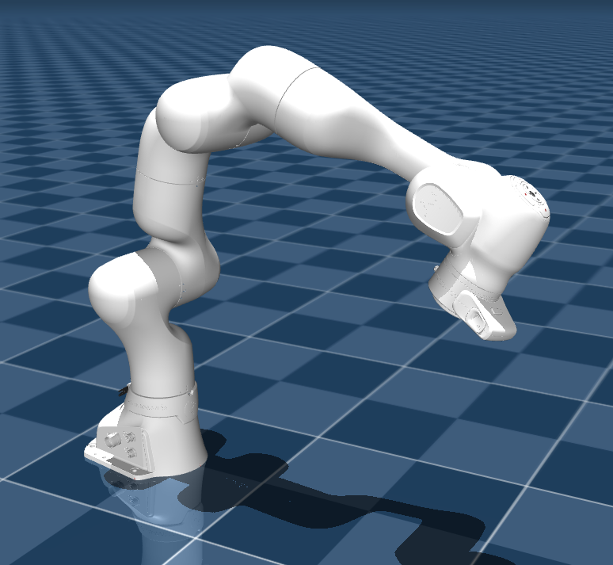
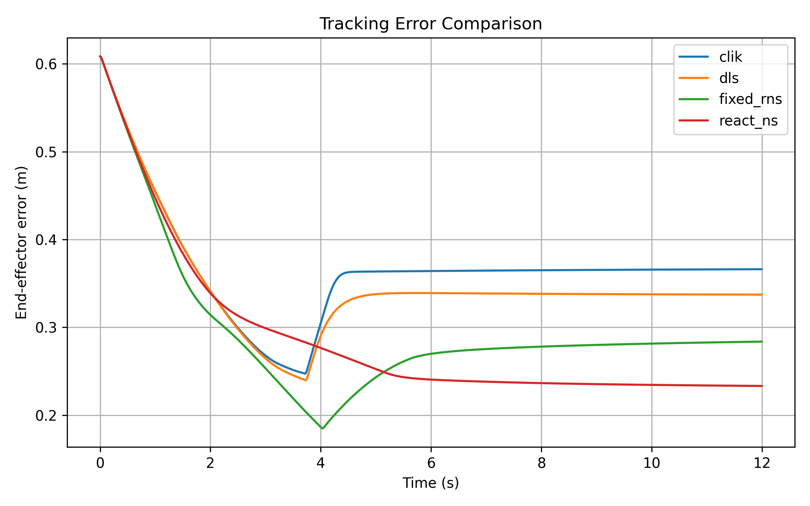
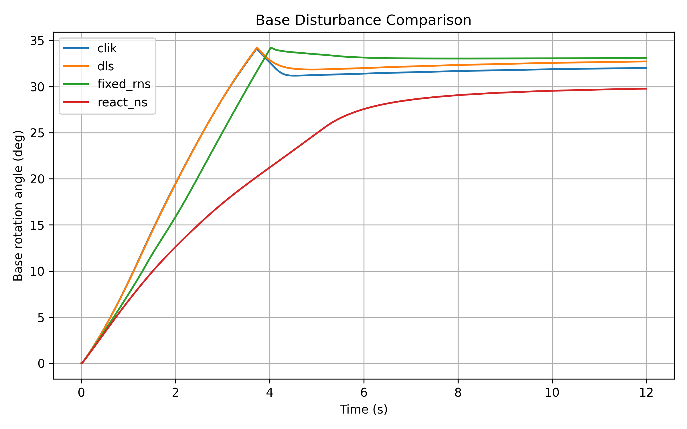
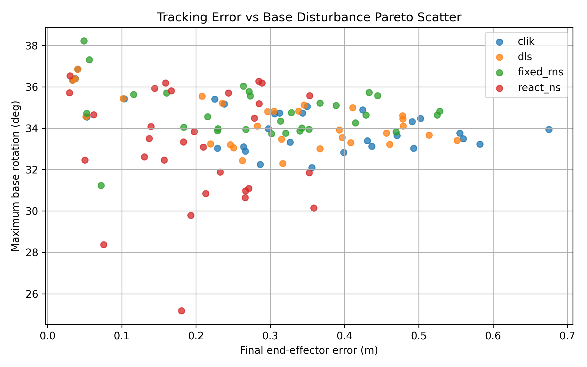
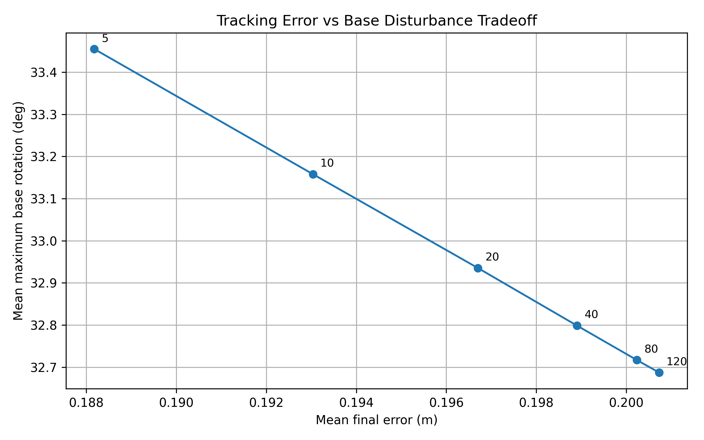

# ReAct-NS
**ReAct-NS** simulation study using a free-floating Franka FR3 model in MuJoCo. The repository contains the experiment scripts, robot model assets, representative numerical results, and plots needed to inspect and reproduce the supplied experiments.

##Robot model assets can be downloaded from the source and get the assets folder to be under react_ns_franka > models > franka_fr3_v2_space > assets

<p align="center">
  
</p>

## Repository contents

```text
react_ns_franka/
├── scripts/                         # Python experiment scripts
│   ├── 01_inspect_model.py
│   ├── 02_test_load_model.py
│   ├── 03_react_ns_demo.py
│   ├── 04_run_comparison.py
│   ├── 05_random_target_benchmark.py
│   ├── 06_mu_sweep.py
│   └── 07_react_ns_mujoco_demo.py
├── models/
│   └── franka_fr3_v2_space/         # FR3 MuJoCo model and mesh assets
├── results/                          # Supplied reference outputs
│   ├── random_benchmark/
│   ├── mu_sweep/
│   ├── base_inertia_sensitivity/
│   └── scientific_plots/
├── docs/images/                      # Small gallery used by this README
├── requirements.txt
├── environment.yml
└── RESULTS.md
```

## Example results

### Single-target tracking

<p align="center">
  
</p>

### Base rotation

<p align="center">
  
</p>

### Random-target benchmark

<p align="center">
  
</p>

### Reaction-weight sweep

<p align="center">
  
</p>

More plots and CSV results are available under [`results/`](results/) and summarized in [`RESULTS.md`](RESULTS.md).

## 1. Requirements

Recommended environment:

- Python 3.11
- MuJoCo 3.1.3 or later
- NumPy
- Matplotlib

The FR3 model included in this repository states that it requires **MuJoCo 3.1.3 or later**.

## 2. Installation

### Option A — Conda / Anaconda Prompt

From the directory where you want to keep the project:

```bash
conda env create -f react_ns_franka/environment.yml
conda activate react-ns
```

If you already have a suitable environment:

```bash
pip install -r react_ns_franka/requirements.txt
```

### Option B — pip

```bash
python -m venv .venv
```

Activate the environment using the method appropriate for your operating system, then run:

```bash
pip install -r react_ns_franka/requirements.txt
```

## 3. Clone or extract with the correct folder name

Because scripts `01`–`06` contain the path `react_ns_franka/...`, the repository directory should be named **`react_ns_franka`**.

```bash
git clone <YOUR-GITHUB-REPOSITORY-URL> react_ns_franka
```

If you download the ZIP from GitHub, rename the extracted folder to `react_ns_franka` if necessary.

Your working directory should look like this:

```text
parent_folder/
└── react_ns_franka/
    ├── scripts/
    ├── models/
    └── results/
```

For scripts `01`–`06`, run the commands **from `parent_folder`**, not from inside `react_ns_franka`.

## 4. Reproduction sequence

### Step 1 — Inspect the MuJoCo model

```bash
python react_ns_franka/scripts/01_inspect_model.py
```

This checks model loading and lists joints, actuators, sites, and bodies.

### Step 2 — Test the model in the MuJoCo viewer

```bash
python react_ns_franka/scripts/02_test_load_model.py
```

A MuJoCo viewer window should open if graphical display is available.

### Step 3 — Run an interactive controller demo

```bash
python react_ns_franka/scripts/03_react_ns_demo.py
```

The controller used by this script is selected by the `CONTROLLER` variable already present in the original source.

### Step 4 — Reproduce the main controller comparison

```bash
python react_ns_franka/scripts/04_run_comparison.py
```

The script compares:

- CLIK
- DLS
- Fixed-RNS
- ReAct-NS

Outputs are written to `react_ns_franka/results/`, including CSV time series, aggregate metrics, and comparison plots.

### Step 5 — Reproduce the random-target benchmark

```bash
python react_ns_franka/scripts/05_random_target_benchmark.py
```

Outputs are written to:

```text
react_ns_franka/results/random_benchmark/
```

The supplied configuration uses a fixed random seed and evaluates the four controllers across randomly sampled target positions.

### Step 6 — Reproduce the ReAct-NS reaction-weight sweep

```bash
python react_ns_franka/scripts/06_mu_sweep.py
```

Outputs are written to:

```text
react_ns_franka/results/mu_sweep/
```

The supplied sweep evaluates multiple values of `mu_max` and saves both trial-level and summary results.

### Step 7 — Optional ReAct-NS visualization demo

`scripts/07_react_ns_mujoco_demo.py` resolves its model path relative to the script location, so it can be launched from the repository directory:

```bash
cd react_ns_franka
python scripts/07_react_ns_mujoco_demo.py
```

This provides the supplied MuJoCo visualization-oriented ReAct-NS demo.

## 5. Comparing a fresh run with the supplied results

Reference results are intentionally included so that a new run can be sanity-checked against the original supplementary package.

Start with:

```text
results/metrics_single_target.csv
results/random_benchmark/metrics_random_targets_summary.csv
results/mu_sweep/mu_sweep_summary.csv
```

For a visual comparison, see the PNG files in the corresponding result directories. See [`RESULTS.md`](RESULTS.md) for a concise map of the included outputs.

## 6. Model attribution and license

The model under `models/franka_fr3_v2_space/` is the **Franka Robotics FR3 Description (MJCF)**. Its bundled README states that it is derived from the publicly available Franka FR3 description and released under the Apache License 2.0.

Please retain the model's original:

- `models/franka_fr3_v2_space/README.md`
- `models/franka_fr3_v2_space/LICENSE`
- `models/franka_fr3_v2_space/CHANGELOG.md`

No separate top-level software license has been added to the ReAct-NS scripts by this packaging step.

## 7. Citation

If you use this repository in academic work, please cite the associated ReAct-NS paper. Full publication metadata can be added here when available.

---

This repository is organized as a **replication guide**: the original scripts are retained, reference outputs are included, and the README explains the working-directory convention required by the supplied paths.
